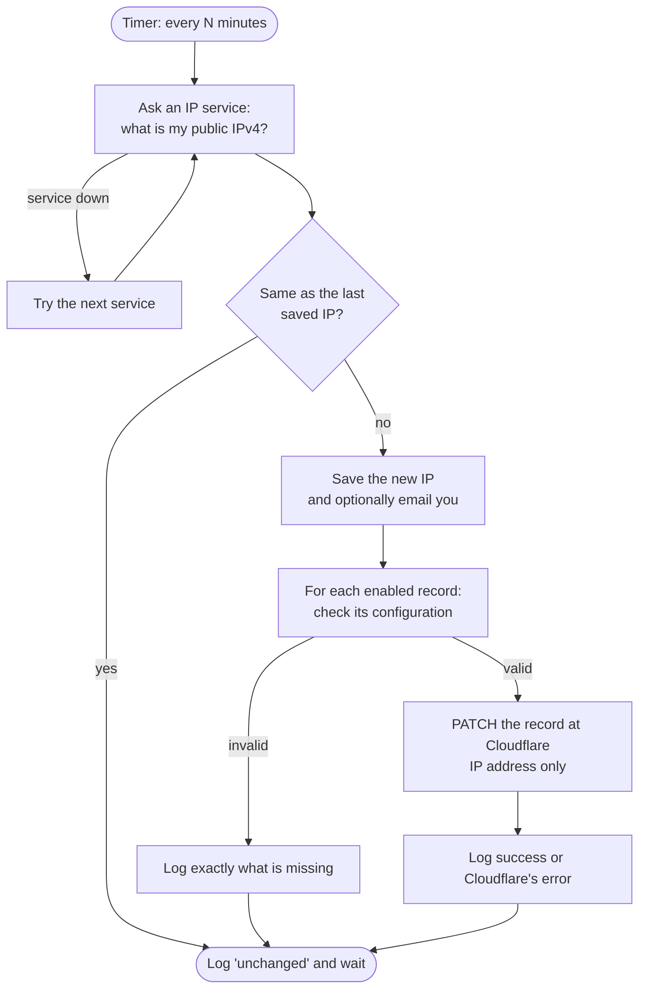

# DdnsUpdate.NET

**Keep your Cloudflare DNS pointed at home, automatically, with a Windows app you can verify before you trust it.**

[Download the latest release](https://github.com/paultechguy/DdnsUpdate.NET/releases/latest) · [Project site](https://paultechguy.github.io/DdnsUpdate.NET/) · [Changelog](CHANGELOG.md) · MIT licensed

---

## The problem

You host something at home or in a small office: a VPN endpoint, a game server, Home Assistant, a NAS, a camera system. People reach it through a friendly name like `home.example.com`, and Cloudflare DNS turns that name into your public IP address.

Most home and small-business internet plans don't give you a *fixed* public IP address. Your ISP can change it after a router reboot, a power cut, maintenance, or just because a lease expired. When it changes:

- `home.example.com` still points at the **old** address,
- everything that depends on the name silently stops working, and
- you usually find out when you're away from home and need it most.

The fix is **dynamic DNS (DDNS)**: something on your network keeps watching the public IP address and updates the DNS record the moment it changes. DdnsUpdate is that something, for Cloudflare.

## What DdnsUpdate does

DdnsUpdate runs on a Windows machine inside your network and, on a schedule you choose:

1. **Finds your current public IPv4 address** by asking one of several free "what's my IP" services, falling back to the next one if a service is down.
2. **Compares it with the last address it saw.** If nothing changed, it does nothing, so Cloudflare isn't called at all.
3. **Updates only what changed.** For each Cloudflare DNS record you enable, it sends a small `PATCH` that changes the IP address and nothing else. Your proxy (orange cloud), TTL and comments are left alone.
4. **Tells you about it** in a daily log file and, if you want, an email.

It runs as a **Windows Service** or as a **Scheduled Task**, it's a single self-contained `.exe` (no .NET install needed), and it comes with a **`--dry-run` mode** that proves your configuration against Cloudflare without changing anything.

### How it works



---

## Your path to a confident deployment

This guide takes you from nothing to a production setup you trust, one verifiable step at a time. Nothing before Step 6 can change your DNS.

| Step | You will | Changes DNS? |
|---|---|---|
| [1. Get the app](#step-1--get-the-app) | Download a release, or build it from source | No |
| [2. First launch](#step-2--first-launch) | Run it with the default settings | No |
| [3. Gather your Cloudflare details](#step-3--gather-your-cloudflare-details) | Create an API token; find the zone and record IDs | No |
| [4. Configure](#step-4--configure) | Write your settings file | No |
| [5. Prove it with a dry run](#step-5--prove-it-with-a-dry-run) | Check everything against Cloudflare, read-only | No |
| [6. Your first real update](#step-6--your-first-real-update) | Run one real pass and check the result | **Yes** |
| [7. Run it in production](#step-7--run-it-in-production) | Install as a Windows Service or a Scheduled Task | Yes |
| [8. Operate with confidence](#step-8--operate-with-confidence) | Monitor, get notified, change settings, upgrade | Yes |

### Before you start

- A Windows 10 or later (x64) machine that stays on and sits on the network whose IP address you want to publish. A home server, NAS host or always-on PC is ideal.
- A Cloudflare account, with your domain using Cloudflare DNS.
- The DNS record you want kept up to date (for example `home.example.com`) already created in Cloudflare as an **A** record. Any IP address is fine to start with; DdnsUpdate will correct it.
- About 20 minutes.

> DdnsUpdate updates **IPv4 (A) records**. It doesn't manage IPv6 (AAAA) records.

---

## Step 1 — Get the app

### Option A: download a release (recommended)

1. Download `DdnsUpdate-<version>-win-x64.zip` from the [latest release](https://github.com/paultechguy/DdnsUpdate.NET/releases/latest).
2. **Verify the download.** The release page lists the SHA256 checksum. In PowerShell:

   ```powershell
   Get-FileHash .\DdnsUpdate-0.2.0-win-x64.zip -Algorithm SHA256
   ```

   The hash must match the one on the release page exactly.
3. The app is not code-signed, so Windows marks downloaded files as coming from the internet. Unblock the zip before extracting it:

   ```powershell
   Unblock-File .\DdnsUpdate-0.2.0-win-x64.zip
   ```
4. Extract it to a permanent folder. This guide uses **`C:\DdnsUpdate`**.

### Option B: build from source

You need the [.NET 10 SDK](https://dotnet.microsoft.com/download) and Git.

```powershell
git clone https://github.com/paultechguy/DdnsUpdate.NET.git
cd DdnsUpdate.NET

dotnet build        # compiles everything; should report 0 warnings
dotnet test         # runs the unit tests; all should pass
dotnet publish src\DdnsUpdate.Application -p:PublishProfile=win-x64-single
```

The publish step produces a single self-contained `DdnsUpdate.exe` in the `publish` folder. Copy the contents of `publish`, except the `.pdb` debug files, to **`C:\DdnsUpdate`**. For more detail see [docs/BUILDING.md](docs/BUILDING.md).

### What's in the folder

```text
C:\DdnsUpdate
    DdnsUpdate.exe                 the whole application
    appsettings.json               built-in defaults (the list of IP services)
    appsettings.production.json    production defaults and a disabled example domain
```

In Step 4 you'll add one more file of your own, `appsettings.production.user.json`, for your personal settings.

---

## Step 2 — First launch

Open a PowerShell window, go to the folder and run the app once with its default settings. Nothing is enabled out of the box, so this is completely safe.

```powershell
cd C:\DdnsUpdate
.\DdnsUpdate.exe --help
```

```text
  --dry-run    Preview one pass: detect the IP, check every enabled domain's DNS
               record, and report what would change. Changes nothing.
  --once       Run one real update pass, then exit.
  --help       Display this help screen.
  --version    Display version information.
```

Now a dry run, which you'll use a lot:

```powershell
.\DdnsUpdate.exe --dry-run
```

```text
[12:30:54 INF] PRODUCTION environment detected
[12:30:54 INF] Starting DdnsUpdate by PaulTechGuy, v0.2.0.0
[12:30:54 INF] DRY RUN: nothing will be changed (no DNS updates, no saved state, no email)
[12:30:55 WRN] DRY RUN: no enabled domains; a real run would do nothing
[12:30:55 INF] Stopping DdnsUpdate
```

✅ **Checkpoint:** you see `PRODUCTION environment detected` and the app exits by itself. If you see `Unable to determine DOTNET environment`, `appsettings.production.json` is not in the same folder as the exe.

---

## Step 3 — Gather your Cloudflare details

You need four things. Write them down as you go.

| What | Example | Where it comes from |
|---|---|---|
| Record name | `home.example.com` | The DNS record you want kept up to date |
| API token | `Zx9…` (40 characters) | Created below |
| Zone ID | `023e105f4ecef8ad9ca31a8372d0c353` | Your domain's *Overview* page |
| Record ID | `372e67954025e0ba6aaa6d586b9e0b59` | Looked up below |

### 3a. Create an API token

An API token can be limited to exactly what DdnsUpdate needs: editing DNS in the zones you choose. It can't touch anything else in your account.

1. In the Cloudflare dashboard, open **My Profile → API Tokens → Create Token**.
2. Next to **Edit zone DNS**, choose **Use template**.
3. Under **Zone Resources**, choose *Include → Specific zone →* your domain. Add a line for each domain you'll update.
4. **Continue to summary → Create Token**, and copy the token. Cloudflare shows it only once.

Check that the token works:

```powershell
$token = '<your API token>'
Invoke-RestMethod 'https://api.cloudflare.com/client/v4/user/tokens/verify' -Headers @{ Authorization = "Bearer $token" }
```

You should see `status : active` in the result.

> **Global API Key (legacy):** DdnsUpdate still accepts the account-wide Global API Key together with your account email. Existing setups keep working. For new setups use a token: a leaked token exposes one zone's DNS, while a leaked Global API Key exposes your whole account.

### 3b. Find the zone ID

In the dashboard, open your domain. The **Zone ID** is on the **Overview** page, in the **API** section of the right-hand column.

### 3c. Find the record ID

Cloudflare doesn't show record IDs in the dashboard, so ask the API. This lists your A records:

```powershell
$zone = '<your zone ID>'
(Invoke-RestMethod "https://api.cloudflare.com/client/v4/zones/$zone/dns_records?type=A" -Headers @{ Authorization = "Bearer $token" }).result |
    Select-Object id, name, content, proxied
```

```text
id                                name              content       proxied
--                                ----              -------       -------
372e67954025e0ba6aaa6d586b9e0b59  home.example.com  198.51.100.1  True
```

The `id` column is your record ID. Prefer curl? The same request is `curl "https://api.cloudflare.com/client/v4/zones/{zoneId}/dns_records?type=A" -H "Authorization: Bearer {token}"`.

---

## Step 4 — Configure

### Where your settings go

DdnsUpdate reads its settings from these files in its own folder. A value in a later file overrides the same value in an earlier one:

1. `appsettings.json`: built-in defaults. Don't edit it.
2. `appsettings.production.json`: production defaults. Don't edit it.
3. **`appsettings.production.user.json`: yours.** Create it. It holds only what you want to change, including your token.

Keeping your values in your own file means **upgrading never overwrites them**. A new release replaces only `DdnsUpdate.exe`.

### A complete starter file

Create `C:\DdnsUpdate\appsettings.production.user.json`:

```json
{
    "cloudflareSettings": {
        "defaultDomain": {
            "recordType": "A",
            "apiToken": "<your API token>"
        },
        "domains": [
            {
                "isEnabled": true,
                "name": "home.example.com",
                "zoneId": "<your zone ID>",
                "recordId": "<your record ID>"
            }
        ]
    }
}
```

That's a complete, working configuration: one record, updated every 60 minutes.

### More than one record

Values in `defaultDomain` apply to every domain that leaves them empty, so shared values like the token go there once. The first entry in `domains` replaces the disabled example in `appsettings.production.json`; add as many more as you need:

```json
"domains": [
    { "isEnabled": true, "name": "home.example.com", "zoneId": "<zone of example.com>", "recordId": "<record ID>" },
    { "isEnabled": true, "name": "vpn.example.com",  "zoneId": "<zone of example.com>", "recordId": "<record ID>" },
    { "isEnabled": true, "name": "example.net",      "zoneId": "<zone of example.net>", "recordId": "<record ID>" }
]
```

A domain can also carry its own `apiToken`, or legacy `authorizationKey` plus `authorizationEmail`, for example to update a record in a different Cloudflare account. **A domain's own credentials beat the defaults, and at either level a token beats a key.**

### Optional: check more or less often

The default is every 60 minutes. Ten minutes is a common choice for services you rely on:

```json
"applicationSettings": {
    "ddnsSettings": {
        "afterAllDdnsUpdatePauseMinutes": 10
    }
}
```

This `applicationSettings` block sits next to `cloudflareSettings` in the same file. Every available setting is listed in the [settings reference](#settings-reference).

---

## Step 5 — Prove it with a dry run

This is the step that turns "I think it's configured" into "I know it works".

```powershell
cd C:\DdnsUpdate
.\DdnsUpdate.exe --dry-run
```

A dry run does everything a real run does, **except change things**:

- it finds your public IP address,
- checks each enabled domain's configuration,
- **reads each DNS record from Cloudflare** using your credentials, which proves the token, zone ID and record ID all work,
- confirms each record ID belongs to the name and record type you configured, so a copy-paste mistake can't overwrite the wrong record,
- and reports what a real run would do.

It never updates DNS, never saves the IP address or statistics, and never sends email.

### Reading the output

```text
[12:41:02 INF] DRY RUN: nothing will be changed (no DNS updates, no saved state, no email)
[12:41:03 INF] DRY RUN: external IP is 203.0.113.7 via https://api.ipify.org/; last saved IP is none
[12:41:03 INF] DRY RUN: a real run would update 1 domain(s)
[12:41:03 INF] DRY RUN: home.example.com: would change 198.51.100.1 -> 203.0.113.7
[12:41:03 INF] DRY RUN complete: no problems found
```

| You see | It means |
|---|---|
| `would change A -> B` | Everything works. A real run will update this record from A to B. |
| `record already points to …; OK` | Everything works, and the record is already correct. |
| `invalid configuration; …` | A value is missing. The message names it. |
| `cannot read the DNS record; …` | Cloudflare refused or couldn't find it. See [troubleshooting](#troubleshooting). |
| `recordId … is the record for X, not Y` | The record ID belongs to a different name. Recheck Step 3c. |
| `DRY RUN complete: no problems found` | ✅ Ready for Step 6. |

The dry run **exits with code 0 when everything is fine and 1 when any domain has a problem**, so you can also check it from a script:

```powershell
.\DdnsUpdate.exe --dry-run; if ($LASTEXITCODE -eq 0) { 'Ready' } else { 'Fix the errors above' }
```

✅ **Checkpoint:** `DRY RUN complete: no problems found`. Fix anything else before moving on. Re-run as often as you like; it's free and harmless.

---

## Step 6 — Your first real update

Run one real pass, then exit:

```powershell
.\DdnsUpdate.exe --once
```

```text
[12:45:10 INF] Checking for initial IP address: none found
[12:45:11 INF] New IP address found: 203.0.113.7
[12:45:11 INF] #1: Current external IP is 203.0.113.7 via URL https://api.ipify.org/
[12:45:11 INF] #1: Processing IP updates for 1 domain(s)
[12:45:11 INF] #1: Domain home.example.com, IP updated to 203.0.113.7
[12:45:11 INF] Maximum DDNS updates (1) reached; stopping
```

Now confirm it three ways:

1. **In Cloudflare:** the record shows the new IP address, and if it was proxied, the orange cloud is **still on**.
2. **From the outside:** `Resolve-DnsName home.example.com -Server 1.1.1.1` returns the new address (or a Cloudflare address if the record is proxied).
3. **Run it again:** `.\DdnsUpdate.exe --once` now says `IP address 203.0.113.7 unchanged … skip 1 DDNS update(s)`. That's the normal steady state: no change, no Cloudflare call.

✅ **Checkpoint:** you've watched DdnsUpdate make one correct change and then correctly do nothing. Time to automate it.

---

## Step 7 — Run it in production

Pick **one** of the two ways below. Running both would do the same work twice.

| | Windows Service | Scheduled Task |
|---|---|---|
| How it runs | Always running; checks every `afterAllDdnsUpdatePauseMinutes` | Windows starts it every N minutes; one pass, then it exits |
| Interval set in | Your settings file (hot-reloaded) | The task's trigger |
| Recovers from crashes | Yes, with service recovery options (below) | Yes, the next trigger simply runs it again |
| Visible in | Services (`services.msc`) | Task Scheduler (`taskschd.msc`) |
| Best for | Always-on servers; checks every few minutes | Machines where you prefer nothing resident; simplest to reason about |

Both run under the built-in **SYSTEM** account by default, so no password is stored, and both write the same logs. Run the commands below in an **administrator** PowerShell.

### Option A: Windows Service

1. **Create the service**, starting automatically shortly after boot, once the network is up:

   ```powershell
   sc.exe create DdnsUpdate binPath= "C:\DdnsUpdate\DdnsUpdate.exe" start= delayed-auto DisplayName= "DdnsUpdate (Cloudflare DDNS)"
   sc.exe description DdnsUpdate "Keeps Cloudflare DNS records pointed at this network's public IP address."
   ```

   The spaces after `binPath=`, `start=` and `DisplayName=` are required by `sc.exe`.

2. **Tell Windows to restart it if it ever fails.** DdnsUpdate exits with code 1 on an unexpected error, which triggers these actions:

   ```powershell
   sc.exe failure DdnsUpdate reset= 86400 actions= restart/60000/restart/60000/restart/300000
   ```

3. **Start it and check it:**

   ```powershell
   sc.exe start DdnsUpdate
   sc.exe query DdnsUpdate          # STATE should be RUNNING
   Get-Content "$env:ProgramData\PaulTechGuy\DdnsUpdate\logs\log_$(Get-Date -Format yyyyMMdd).txt" -Tail 20
   ```

To stop or remove it later: `sc.exe stop DdnsUpdate` and `sc.exe delete DdnsUpdate`. Close the Services window first, or the delete can hang.

### Option B: Scheduled Task

The task runs `DdnsUpdate.exe --once` on a timer. Each run checks once, updates only if needed, and exits.

```powershell
$action    = New-ScheduledTaskAction -Execute 'C:\DdnsUpdate\DdnsUpdate.exe' -Argument '--once'
$trigger   = New-ScheduledTaskTrigger -Once -At (Get-Date) -RepetitionInterval (New-TimeSpan -Minutes 10)
$settings  = New-ScheduledTaskSettingsSet -StartWhenAvailable -MultipleInstances IgnoreNew -ExecutionTimeLimit (New-TimeSpan -Minutes 5)
$principal = New-ScheduledTaskPrincipal -UserId 'SYSTEM' -LogonType ServiceAccount -RunLevel Highest
Register-ScheduledTask -TaskName 'DdnsUpdate' -Action $action -Trigger $trigger -Settings $settings -Principal $principal `
    -Description 'Keeps Cloudflare DNS records pointed at this network''s public IP address.'
```

- A trigger with a repetition interval and no end date repeats indefinitely on current Windows versions.
- `IgnoreNew` prevents overlapping runs.
- **Start in** isn't needed; DdnsUpdate always works from its own folder.

Check it:

```powershell
Start-ScheduledTask -TaskName 'DdnsUpdate'
Get-ScheduledTaskInfo -TaskName 'DdnsUpdate' | Select-Object LastRunTime, LastTaskResult   # 0 = success
```

To remove it: `Unregister-ScheduledTask -TaskName 'DdnsUpdate'`.

✅ **Checkpoint:** after the first interval, the log shows a new pass, either `unchanged` or an update.

---

## Step 8 — Operate with confidence

### Know what it's doing

Everything goes to a daily log file, and the last 31 days are kept:

```text
C:\ProgramData\PaulTechGuy\DdnsUpdate\
    logs\log_20260928.txt     one file per day
    LastIpAddress.txt         the last IP address pushed to DNS
    UriStatistics.json        success and failure counts per IP service
```

A healthy log is mostly `IP address … unchanged` lines, with an occasional `New IP address found` followed by one `IP updated` line per domain.

### Get told when your IP changes

Add email settings to your `appsettings.production.user.json`. For Gmail, use an [app password](https://support.google.com/mail/answer/185833):

```json
"applicationSettings": {
    "workerServiceSettings": {
        "messageIsEnabled": true,
        "messageToEmailAddress": "Me <me@example.com>",
        "messageFromEmailAddress": "DdnsUpdate <me@gmail.com>"
    },
    "emailSmtpSettings": {
        "smtpHost": "smtp.gmail.com",
        "smtpPort": 587,
        "smtpEnableSsl": true,
        "smtpUsername": "me@gmail.com",
        "smtpPassword": "<app password>"
    }
}
```

With `smtpEnableSsl` set to `true`, the connection uses STARTTLS, or implicit TLS on port 465. To try email without a real server, point `smtpHost` at `localhost`, port 25, with SSL off, and run [Papercut-SMTP](https://www.papercut-smtp.com/).

### Change settings safely

Settings files are watched, so a running service picks up edits on its next pass without a restart. After any change, **run `.\DdnsUpdate.exe --dry-run` first.** It's safe even while the service is running, because a dry run changes nothing.

### Upgrade

1. Read the release's notes and the [changelog](CHANGELOG.md).
2. Stop the service (`sc.exe stop DdnsUpdate`) or disable the task.
3. Back up `C:\DdnsUpdate`.
4. Replace **only `DdnsUpdate.exe`**. Your `appsettings.production.user.json` stays as it is.
5. Run `.\DdnsUpdate.exe --dry-run`, then start the service or re-enable the task.

### Exit codes

| Code | Meaning |
|---|---|
| `0` | Normal finish, or a dry run with no problems |
| `1` | Couldn't start (for example invalid settings or an unknown argument), an unexpected error, or a dry run that found a problem |

A failed update for one domain is logged but doesn't change the exit code; the next pass retries it.

---

## Troubleshooting

| Symptom (log message) | Likely cause | Fix |
|---|---|---|
| `Unable to determine DOTNET environment` | `appsettings.production.json` isn't next to the exe | Restore it from the release zip |
| `Hosting failed to start … ipAddressProviders must contain at least one absolute http(s) URL` | An IP service URL in your settings is malformed | Fix or remove the `ipAddressProviders` entry |
| `Invalid configuration for X; …` / `invalid configuration; …` | A required value is empty in both the domain and `defaultDomain` | Add the value named in the message |
| `cannot read the DNS record; BadRequest … "code":9106 … Authentication failed` / `IP update failed … 9106` | The token (or key and email) is wrong or mistyped | Re-copy the token; test it with the verify command in [Step 3a](#3a-create-an-api-token) |
| `Forbidden` from Cloudflare | The token doesn't have DNS edit permission for this zone | Edit the token's **Zone Resources** to include the zone |
| `NotFound` from Cloudflare | Wrong zone ID or record ID, or the record was deleted | Repeat [Step 3c](#3c-find-the-record-id) |
| `recordId … is the record for X, not Y` | The record ID belongs to another record | Use the ID listed next to the right name |
| `the record is type AAAA, but recordType is A` | The record ID points to an IPv6 record | Use the A record's ID; DdnsUpdate updates IPv4 only |
| `Unable to determine external IP address` | Outbound HTTPS is blocked, or every IP service failed | Check the firewall or proxy; look at `UriStatistics.json` for failing services |
| Dry run warns `record points to A, not B, but a real run would skip it` | Someone changed the record by hand since the last run | Delete `LastIpAddress.txt`, or set `alwaysUpdateDdnsEvenIfUnchanged` to `true` for one run |
| Nothing updates, log says `unchanged` | Working as designed: the IP address hasn't changed | Nothing to fix |
| `IP address email send failed: …` | SMTP settings or credentials are wrong | Check `emailSmtpSettings`; test with Papercut |
| Task Scheduler shows `0x1` | The run failed | The log file for that day says why |
| `sc.exe delete` hangs or the service is "marked for deletion" | The Services window is open | Close `services.msc` and try again |

Still stuck? Run `.\DdnsUpdate.exe --dry-run` and read its errors from the top. It checks the most common problems one domain at a time.

---

## Security notes

- **Use a scoped API token** limited to *Zone → DNS → Edit* on the zones you need. Don't use the Global API Key for new setups.
- **Keep secrets in `appsettings.production.user.json`**, not in the shipped files. Then limit who can read it. The service and task run as SYSTEM, so this is enough:

  ```powershell
  icacls C:\DdnsUpdate\appsettings.production.user.json /inheritance:r /grant:r "SYSTEM:(R)" "Administrators:(F)"
  ```
- **Only what's needed leaves the machine:** requests to your configured IP services, to `api.cloudflare.com`, and to your SMTP server if email is on. There's no telemetry.
- **Verify downloads** with the SHA256 checksum on the release page ([Step 1](#step-1--get-the-app)).
- **If a token leaks**, roll it in Cloudflare (**My Profile → API Tokens → Roll**), then update your settings file. The service picks up the change on its next pass.

---

## Settings reference

All settings live in JSON. Put yours in `appsettings.production.user.json`. Any setting can also come from an environment variable, using `__` between levels, for example `applicationSettings__ddnsSettings__afterAllDdnsUpdatePauseMinutes=10`.

### `cloudflareSettings`

| Setting | Default | Description |
|---|---|---|
| `defaultDomain.zoneId` | *(empty)* | Zone ID for domains that don't set their own |
| `defaultDomain.recordType` | `A` | Record type; must match the record in Cloudflare |
| `defaultDomain.apiToken` | *(empty)* | API token (recommended) |
| `defaultDomain.authorizationKey` | *(empty)* | Legacy Global API Key; used only when no token applies |
| `defaultDomain.authorizationEmail` | *(empty)* | Account email that goes with the Global API Key |
| `domains[].isEnabled` | `false` | Only enabled domains are checked or updated |
| `domains[].name` | *(required)* | The record's full name, e.g. `home.example.com` |
| `domains[].recordId` | *(required)* | The record's ID (Step 3c); never taken from the defaults |
| `domains[].zoneId`, `.recordType`, `.apiToken`, `.authorizationKey`, `.authorizationEmail` | *(empty)* | Per-domain overrides of the `defaultDomain` values |

### `applicationSettings.ddnsSettings`

| Setting | Default | Description |
|---|---|---|
| `afterAllDdnsUpdatePauseMinutes` | `60` | Minutes to wait between passes (service mode). Values of 0 or less mean 1. |
| `alwaysUpdateDdnsEvenIfUnchanged` | `false` | Update records even when the IP hasn't changed. Use it for one run to repair drift; don't leave it on. |
| `maximumDdnsUpdateIterations` | `0` | Passes to run before exiting; 0 runs until stopped. `--once` overrides it with 1. |
| `parallelDdnsUpdateCount` | `1` | Domains updated at once: a negative value uses the .NET default, 0 does all at once, and N does up to N. |
| `randomizeIpAddressProviderSelecion` | `true` | Start with a random IP service each pass, to spread the load. The key's spelling is intentional. |
| `ipAddressProviders` | 8 public services | URLs that return your IP address as text; each is tried in turn until one works |

> **Note on lists:** a list in your file replaces the default list item by item, by position. It doesn't replace the whole list. Your entries overwrite the first defaults, and any defaults beyond them remain, so you can replace or add IP services but not remove them from your own file. Every entry must be a full `http(s)://` URL, or the app refuses to start.

### `applicationSettings.workerServiceSettings` (email notifications)

| Setting | Default | Description |
|---|---|---|
| `messageIsEnabled` | `false` | Send an email when the IP address changes |
| `messageToEmailAddress` | *(empty)* | Recipient, e.g. `Me <me@example.com>` |
| `messageFromEmailAddress` | *(empty)* | Sender |
| `messageReplyToEmailAddress` | *(empty)* | Optional Reply-To address |

### `applicationSettings.emailSmtpSettings`

| Setting | Default | Description |
|---|---|---|
| `smtpHost` | *(empty)* | SMTP server, e.g. `smtp.gmail.com` |
| `smtpPort` | `587` | 587 for STARTTLS, 465 for implicit TLS, 25 for a local test server |
| `smtpEnableSsl` | `true` | Encrypt the connection (STARTTLS, or implicit TLS on port 465) |
| `smtpUsername` | *(empty)* | Leave empty for a server that needs no sign-in |
| `smtpPassword` | *(empty)* | For Gmail, an app password |

The `Serilog` section in the shipped settings files isn't currently used. Logging is always at Information level, to the daily file and to the console when run interactively.

---

## For developers

- **Build, test and publish:** [docs/BUILDING.md](docs/BUILDING.md)
- **Cutting a release:** [docs/Releasing.md](docs/Releasing.md)
- **What changed:** [CHANGELOG.md](CHANGELOG.md)
- **Layout:** `src/` holds the application (the host, the update worker, the email sender and the Cloudflare provider behind an `IDdnsUpdateProvider` interface), and `tests/` holds xUnit tests. Run everything from the repository root with `dotnet build` and `dotnet test`.

Based on the [WinService.Net](https://github.com/paultechguy/WinService.Net) Windows Service template.

## License

[MIT](LICENSE.txt) © PaulTechGuy
